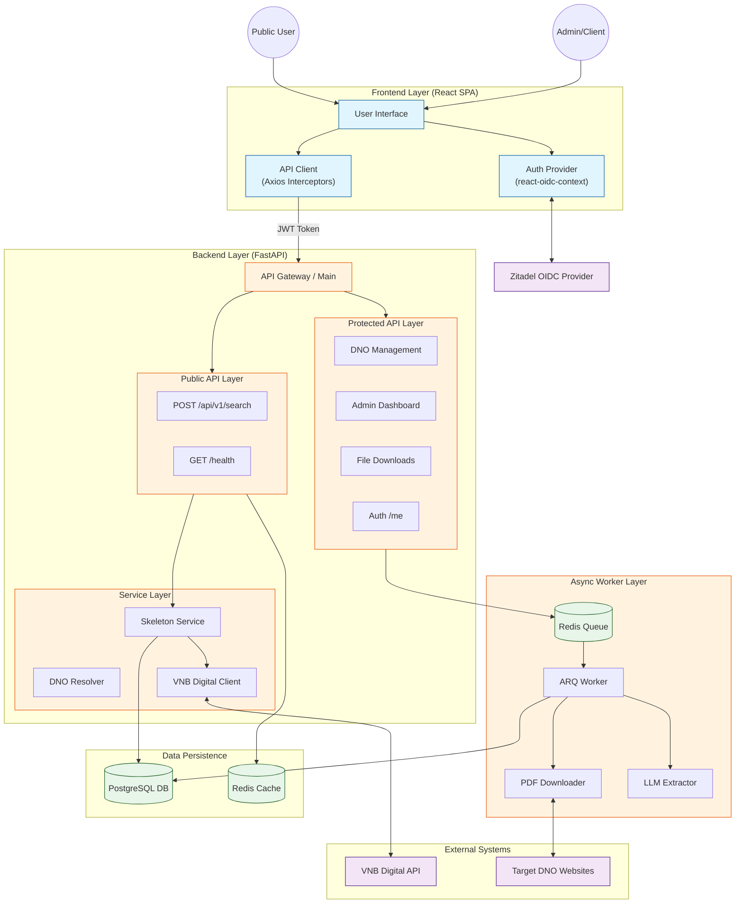
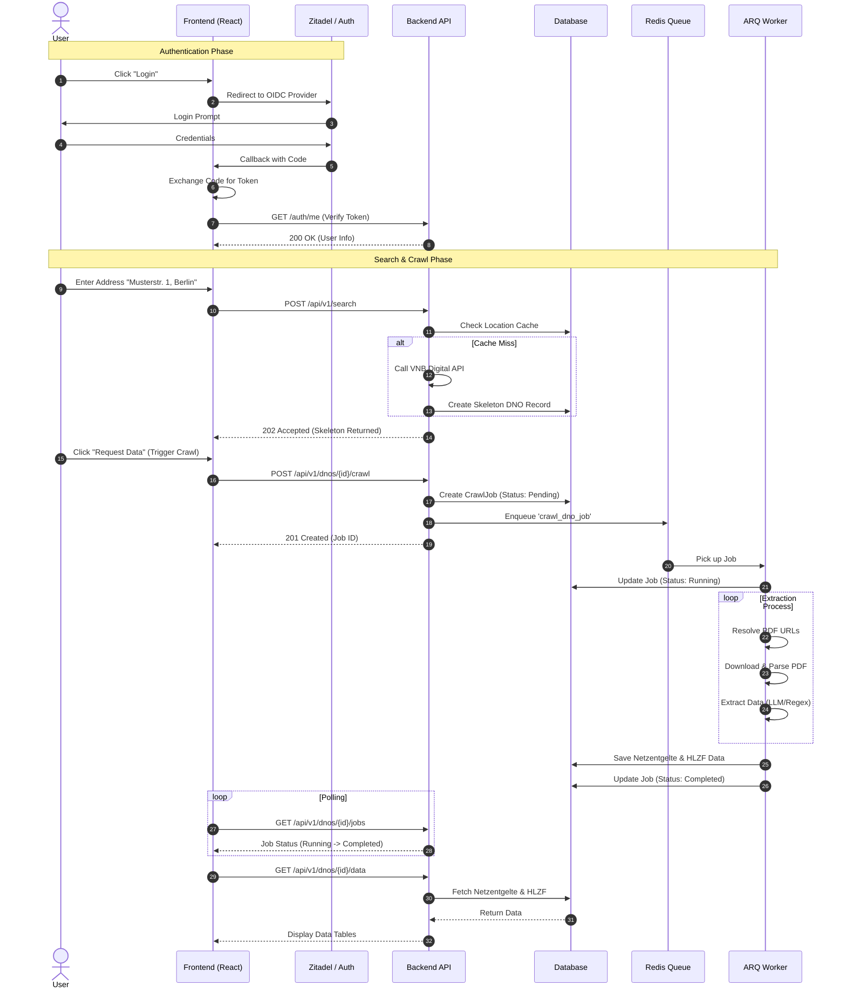
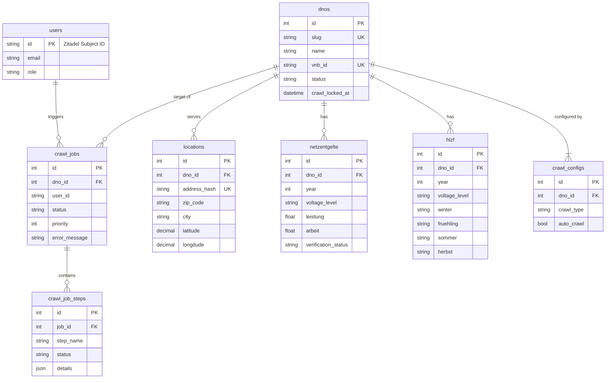

# System Architecture

## Overview
DNO Crawler is a full-stack application designed to extract, normalize, and serve data from German Distribution Network Operators (DNOs). It features a React frontend for user interaction and administration, and a FastAPI backend that orchestrates data retrieval via synchronous APIs and asynchronous background workers.

## 1. System Architecture

The system follows a modern microservices-lite architecture with a clear separation of concerns between the API layer, background processing, and data persistence.

### Key Components
- **Frontend**: Handles OIDC authentication flow and attaches JWT tokens to requests via Axios interceptors. Supports a "No-Auth" fallback for simplified local development.
- **Public API**: Allows unauthenticated users to perform rate-limited searches and generate skeleton DNO records.
- **Protected API**: Secured by `Depends(get_current_user)`, allowing admins/members to trigger crawls and manage data. The authentication strategy is modular (Zitadel OIDC vs. Mock Admin).
- **Async Worker**: Powered by ARQ and Redis, this component handles long-running tasks like crawling, PDF downloading, and LLM extraction to prevent blocking the HTTP API.

---

## 2. Core User Journey

This sequence demonstrates the flow from a user logging in to retrieving complex dataset extraction results.

---

## 3. Database Schema

The database is normalized to support efficient spatial lookups and historical data versioning.

### Key Entities
- **DNOModel (`dnos`)**: The core entity representing a utility provider. Contains VNB Digital integration IDs and crawling status.
- **LocationModel (`locations`)**: Maps addresses and coordinates to DNOs. Uses `address_hash` for efficient lookup and caching of VNB Digital results.
- **Data Tables (`netzentgelte`, `hlzf`)**: Store the extracted pricing and time-window data, linked to DNOs and specific years.
- **Job Tracking (`crawl_jobs`)**: Manages the state of background tasks, providing visibility into the long-running extraction process.
