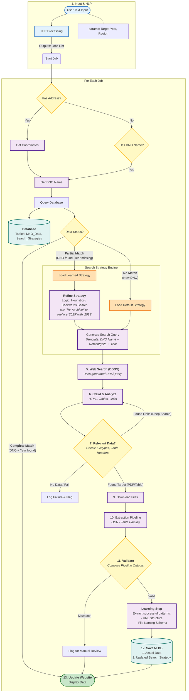

```mermaid
flowchart TD
    %% --- Styles ---
    classDef input fill:#e3f2fd,stroke:#1565c0,stroke-width:2px;
    classDef process fill:#f3e5f5,stroke:#4a148c,stroke-width:2px;
    classDef logic fill:#fff9c4,stroke:#fbc02d,stroke-width:2px;
    classDef db fill:#e0f2f1,stroke:#00695c,stroke-width:2px;
    classDef strategy fill:#ffe0b2,stroke:#ef6c00,stroke-width:2px;
    classDef endNode fill:#c8e6c9,stroke:#2e7d32,stroke-width:2px;

    %% --- 1. Initialization ---
    subgraph Inputs ["1. Input & NLP"]
        UserInput([User Text Input]) --> NLP[NLP Processing]
        NLP -->|Outputs: Jobs List| JobLoop
        
        note1[params: Target Year, Region]
        UserInput -.- note1
    end

    %% --- 2. Resolution Loop ---
    subgraph JobProcessing ["For Each Job"]
        direction TB
        JobLoop(Start Job) --> AddrCheck{Has Address?}
        
        AddrCheck -- Yes --> GetCoords[Get Coordinates]
        GetCoords --> GetDNO[Get DNO Name]
        AddrCheck -- No --> CheckDNOInput{Has DNO Name?}
        CheckDNOInput -- Yes --> GetDNO
        
        %% --- 3. The Brain (DB Check & Strategy) ---
        GetDNO --> DBQuery[Query Database]
        
        DB[("<b>Database</b><br/>Tables: DNO_Data, Search_Strategies")]
        DBQuery <--> DB
        
        DBQuery --> DataCheck{Data Status?}
        
        %% Path A: Data Exists
        DataCheck -- "<b>Complete Match</b><br/>(DNO + Year found)" --> UpdateWeb
        
        %% Path B: Partial Match (Optimization/Heuristic)
        DataCheck -- "<b>Partial Match</b><br/>(DNO found, Year missing)" --> LoadStrat[Load Learned Strategy]
        
        %% Path C: No Match (Cold Start)
        DataCheck -- "<b>No Match</b><br/>(New DNO)" --> DefaultStrat[Load Default Strategy]

        %% --- 4. Strategy Refinement ---
        subgraph StrategyEngine ["Search Strategy Engine"]
            LoadStrat --> RefineStrat["<b>Refine Strategy</b><br/>Logic: Heuristics / Backwards Search<br/><i>e.g. Try '/archive/' or replace '2025' with '2023'</i>"]
            DefaultStrat --> GenQuery["Generate Search Query<br/><i>Template: DNO Name + 'Netzentgelte' + Year</i>"]
            RefineStrat --> GenQuery
        end
        
        %% --- 5. Execution (Search & Crawl) ---
        GenQuery --> Search["<b>5. Web Search (DDGS)</b><br/><i>Uses generated URL/Query</i>"]
        Search --> Crawl["<b>6. Crawl & Analyze</b><br/><i>HTML, Tables, Links</i>"]
        
        Crawl --> IsRelevant{"<b>7. Relevant Data?</b><br/><i>Check: Filetypes, Table Headers</i>"}
        
        %% Recursive Loop
        IsRelevant -- "Found Links (Deep Search)" --> Crawl
        IsRelevant -- "No Data / Fail" --> LogFail[Log Failure & Flag]
        
        %% --- 6. Extraction ---
        IsRelevant -- "Found Target (PDF/Table)" --> Download[9. Download Files]
        Download --> Extract["10. Extraction Pipeline<br/><i>OCR / Table Parsing</i>"]
        
        %% --- 7. Validation ---
        Extract --> Validate{"<b>11. Validate</b><br/><i>Compare Pipeline Outputs</i>"}
        Validate -- "Mismatch" --> ManualReview[Flag for Manual Review]
        
        %% --- 8. Learning & Saving ---
        Validate -- "Valid" --> LearnStep["<b>Learning Step</b><br/>Extract successful patterns:<br/>- URL Structure<br/>- File Naming Schema"]
        
        LearnStep --> SaveDB[("<b>12. Save to DB</b><br/>1. Actual Data<br/>2. Updated Search Strategy")]
    end

    %% --- 9. Final Output ---
    SaveDB --> UpdateWeb(["<b>13. Update Website</b><br/>Display Data"])
    ManualReview --> UpdateWeb

    %% --- Class Assignments ---
    class UserInput,NLP input;
    class GetCoords,GetDNO,Crawl,Download,Extract,RefineStrat,GenQuery,LearnStep,Search process;
    class AddrCheck,CheckDNOInput,DataCheck,IsRelevant,Validate logic;
    class DB,SaveDB db;
    class LoadStrat,DefaultStrat strategy;
    class UpdateWeb endNode;
```