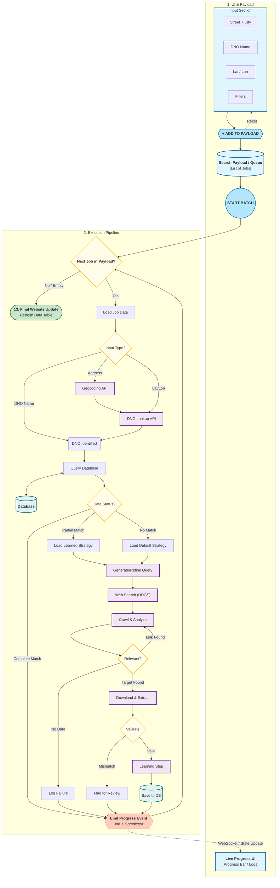

```mermaid
flowchart TD
    %% --- Styles ---
    classDef ui fill:#e1f5fe,stroke:#01579b,stroke-width:2px;
    classDef action fill:#b3e5fc,stroke:#0277bd,stroke-width:2px,shape:rect;
    classDef storage fill:#fff9c4,stroke:#fbc02d,stroke-width:2px,stroke-dasharray: 5 5;
    classDef process fill:#f3e5f5,stroke:#4a148c,stroke-width:2px;
    classDef logic fill:#fffde7,stroke:#fbc02d,stroke-width:2px;
    classDef db fill:#e0f2f1,stroke:#00695c,stroke-width:2px;
    classDef endNode fill:#c8e6c9,stroke:#2e7d32,stroke-width:2px;
    classDef progress fill:#ffccbc,stroke:#bf360c,stroke-width:2px,stroke-dasharray: 5 5;

    %% --- PHASE 1: UI & Payload ---
    subgraph UI_Layer ["1. UI & Payload"]
        direction TB
        
        subgraph Inputs ["Input Section"]
            InputAddr["Street + City"]
            InputDNO["DNO Name"]
            InputCoords["Lat / Lon"]
            Filters["Filters"]
        end

        AddBtn{{<b>+ ADD TO PAYLOAD</b>}}
        PayloadQueue[("<b>Search Payload / Queue</b><br/>[List of Jobs]")]
        StartBtn((<b>START BATCH</b>))
        
        %% NEW: Live Progress Element
        LiveUI["<b>Live Progress UI</b><br/>(Progress Bar / Logs)"]

        Inputs --> AddBtn --> PayloadQueue --> StartBtn
        AddBtn -.->|Reset| Inputs
    end

    %% --- PHASE 2: Execution Loop ---
    subgraph Execution ["2. Execution Pipeline"]
        direction TB
        
        StartBtn --> JobIterator{<b>Next Job in Payload?</b>}
        
        %% LOOP EXIT: Only update website when ALL jobs are done
        JobIterator -- "No / Empty" --> FinalUpdate([<b>13. Final Website Update</b><br/>Refresh Data Table])

        %% LOOP CONTINUE: Process Job
        JobIterator -- "Yes" --> RouteJob[Load Job Data]
        
        %% --- Router ---
        RouteJob --> CheckInputType{Input Type?}
        CheckInputType -- "Address" --> GetCoords["Geocoding API"] --> GetDNOLookup
        CheckInputType -- "Lat/Lon" --> GetDNOLookup["DNO Lookup API"]
        CheckInputType -- "DNO Name" --> MergePoint
        GetDNOLookup --> MergePoint(DNO Identified)
        
        %% --- The Brain ---
        MergePoint --> DBQuery[Query Database]
        DB[("<b>Database</b>")]
        DBQuery <--> DB
        DBQuery --> DataCheck{Data Status?}
        
        %% Paths
        DataCheck -- "Complete Match" --> EmitProgress
        DataCheck -- "Partial Match" --> LoadStrat[Load Learned Strategy]
        DataCheck -- "No Match" --> DefaultStrat[Load Default Strategy]

        %% --- Strategy Engine ---
        LoadStrat & DefaultStrat --> GenQuery["Generate/Refine Query"]
        
        %% --- Execution ---
        GenQuery --> Search["Web Search (DDGS)"]
        Search --> Crawl["Crawl & Analyze"]
        Crawl --> IsRelevant{"Relevant?"}
        
        IsRelevant -- "Link Found" --> Crawl
        IsRelevant -- "No Data" --> LogFail[Log Failure]
        IsRelevant -- "Target Found" --> Download[Download & Extract]
        
        Download --> Validate{"Validate"}
        Validate -- "Mismatch" --> ManualReview[Flag for Review]
        
        %% --- Saving ---
        Validate -- "Valid" --> LearnStep["Learning Step"]
        LearnStep --> SaveDB[("Save to DB")]
        
        %% --- LIVE PROGRESS FEEDBACK LOOP ---
        LogFail & ManualReview & SaveDB --> EmitProgress{{<b>Emit Progress Event</b><br/><i>'Job X Completed'</i>}}
        
        %% 1. Send signal to UI (Async)
        EmitProgress -.->|WebSocket / State Update| LiveUI
        
        %% 2. Loop back to Iterator to get next job
        EmitProgress --> JobIterator
    end

    %% --- Class Assignments ---
    class Inputs,PayloadQueue,LiveUI ui;
    class AddBtn,StartBtn action;
    class GetCoords,GetDNOLookup,Crawl,Download,GenQuery,LearnStep,Search process;
    class JobIterator,CheckInputType,DataCheck,IsRelevant,Validate logic;
    class DB,SaveDB db;
    class FinalUpdate endNode;
    class EmitProgress progress;
```