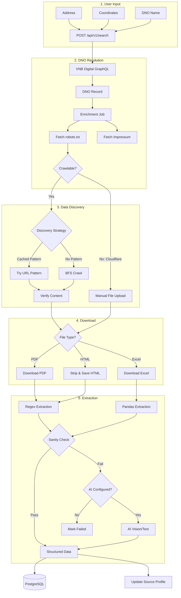
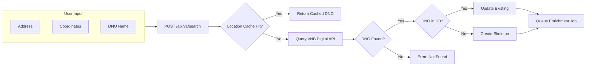
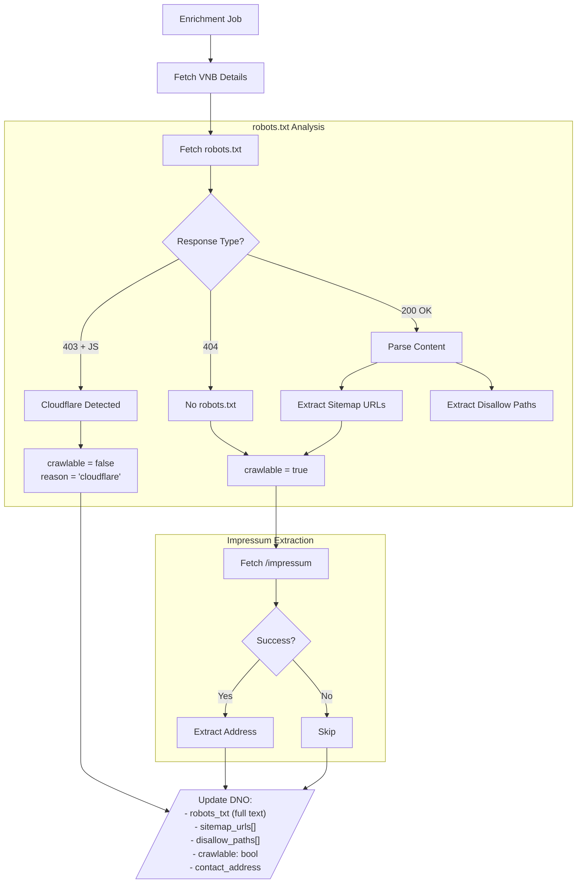
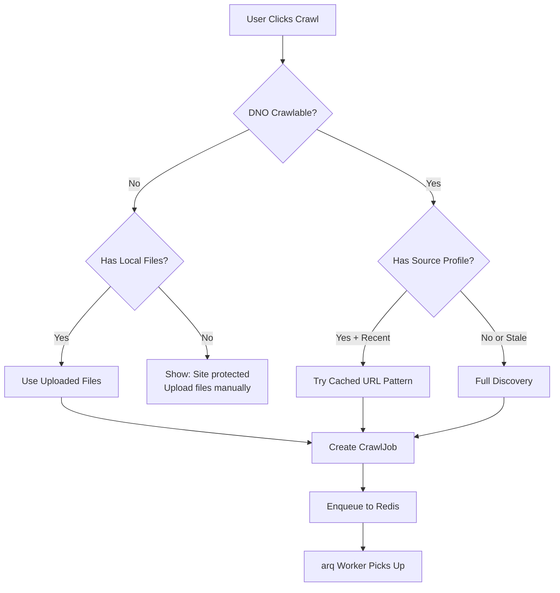
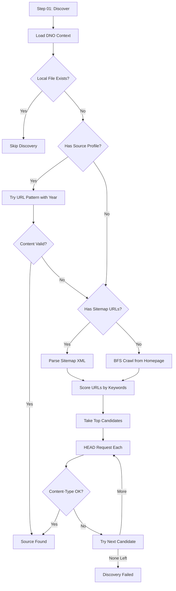
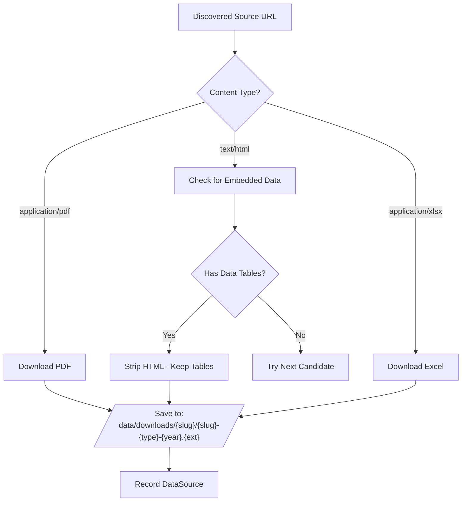
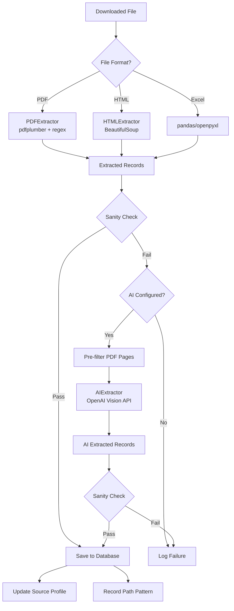
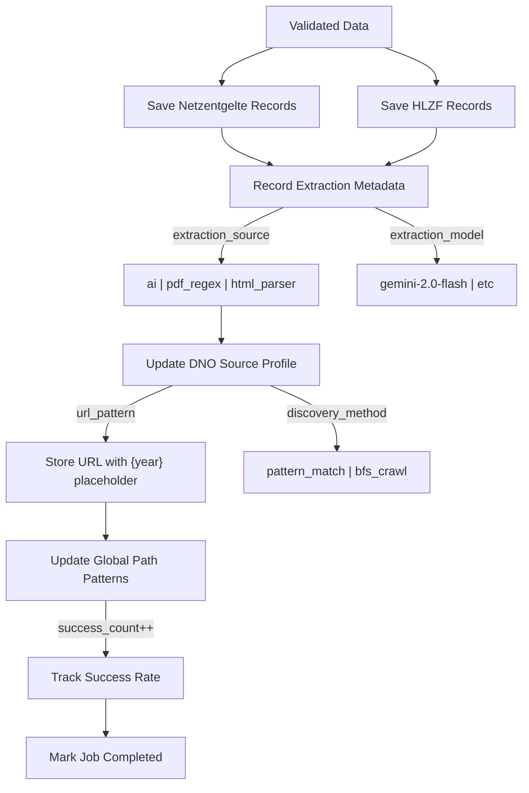
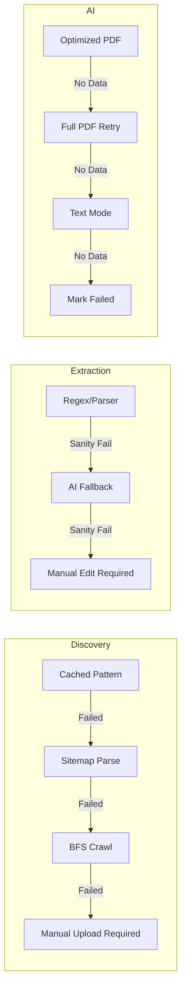
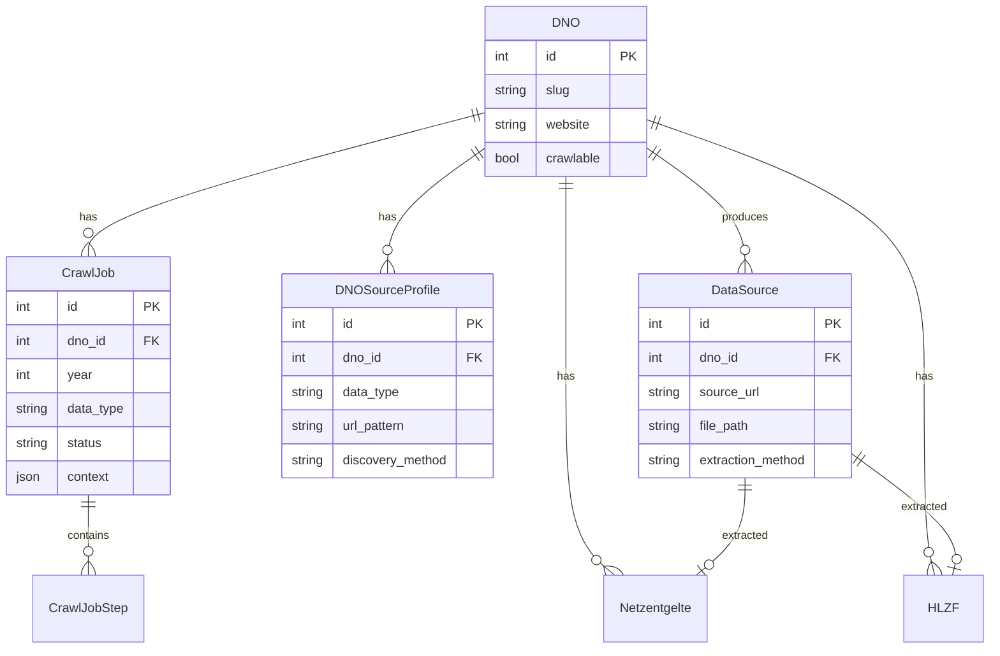

# DNO Crawler - Pipeline Flowchart

This document describes the complete extraction pipeline from user input to structured data.

---

## Overview

---

## Phase 1: Search & DNO Resolution

**VNB Digital Response:**
- `kurzbezeichnung` → Display name
- `vnb_id` → External identifier
- `homepage` → Website URL
- `telefon`, `email` → Contact info
- Address components for location caching

---

## Phase 2: DNO Enrichment

---

## Phase 3: Crawl Job Trigger

---

## Phase 4: Discovery Pipeline

**URL Scoring Algorithm:**

| Factor | Score |
|--------|-------|
| PDF file extension | +20 |
| Excel file extension | +15 |
| Target year in URL | +25 |
| Keyword match (netzentgelte, strom, hlzf) | +15 each |
| Negative keyword (gas, vermiedene) | -15 to -30 |
| Shallow depth (≤2) | +10 |

---

## Phase 5: Download

**HTML Table Detection:**
- Look for `<table>` elements
- Check for keywords: "hochlast", "zeitfenster", "netzentgelt"
- Check for voltage levels: "HS", "MS", "NS", "Umspannung"
- Check for year patterns: "gültig ab 01.01.2025"

---

## Phase 6: Extraction

**Sanity Check Rules:**

| Data Type | Validation |
|-----------|------------|
| Netzentgelte | ≥3 voltage levels, each with arbeit OR leistung non-null |
| HLZF | ≥1 record with winter time window present |

**AI PDF Optimization:**
1. Extract text from each page
2. Filter pages containing target keywords
3. Create optimized PDF (60-80% smaller)
4. Send to vision model
5. If empty result, retry with full PDF

---

## Phase 7: Finalization

---

## Error Handling & Fallbacks

---

## Database Entities

---

## UI States

| DNO State | UI Display | Available Actions |
|-----------|------------|-------------------|
| `crawlable=true, no_data` | "Ready to crawl" | Trigger Crawl |
| `crawlable=true, has_data` | Data tables shown | View/Edit Data, Re-crawl |
| `crawlable=false, has_local_files` | "Files uploaded" | Extract from Files |
| `crawlable=false, no_files` | "Site protected" | Upload Files |
| `job_status=running` | Progress indicator | View Steps |
| `job_status=failed` | Error message | Retry, Manual Edit |
