# DNO Crawler - Complete Pipeline Flowchart

This document describes the complete flow of the DNO data crawler, from user input to extracted data.

---

## Overview

```mermaid
flowchart TB
    subgraph Input["1️⃣ User Input"]
        A1[Address] --> VNB
        A2[Coordinates] --> VNB
        A3[DNO Name] --> VNB
    end
    
    subgraph Skeleton["2️⃣ DNO Skeleton Creation"]
        VNB[VNB Digital API Lookup] --> DNO[DNO Record]
        DNO --> IMP[Fetch Impressum]
        DNO --> ROB[Fetch robots.txt]
        IMP --> |"Extract Address"| ADDR[Enhanced Address]
        ROB --> |"Store Full"| ROBOTS[Stored robots.txt]
        ROB --> |"Check Response"| CRAWL{Crawlable?}
    end
    
    subgraph Discovery["3️⃣ Data Discovery"]
        CRAWL --> |"Yes"| SITEMAP[Parse Sitemap from robots.txt]
        CRAWL --> |"No: JS Challenge"| MANUAL[Mark for Manual Review]
        SITEMAP --> SCORE[Score & Filter URLs]
        SCORE --> TOP[Get Top Candidates]
    end
    
    subgraph Download["4️⃣ Smart Download"]
        TOP --> TYPE{File Type?}
        TYPE --> |"PDF/Excel"| DL_FILE[Download File Directly]
        TYPE --> |"HTML Page"| CHECK_HTML[Check for Embedded Data]
        CHECK_HTML --> |"Has Tables"| STRIP[Strip & Save HTML]
        CHECK_HTML --> |"No Data"| NEXT[Try Next Candidate]
    end
    
    subgraph Extract["5️⃣ Data Extraction"]
        DL_FILE --> AI{AI Configured?}
        STRIP --> AI
        AI --> |"Yes"| AI_EXT[AI Vision Extraction]
        AI --> |"No"| REGEX[Regex Fallback Extraction]
        AI_EXT --> |"Failed"| REGEX
        REGEX --> DATA[Structured Data]
    end
    
    DATA --> DB[(Database)]
```



---

## Phase 1: User Input & DNO Lookup


**VNB API Response Contains:**
- `strasse`, `ort`, `plz` → Address
- `homepage` → Website URL for crawling
- `telefon`, `email` → Contact info
- `kurzbezeichnung` → Short name/slug

---

## Phase 2: DNO Skeleton Creation


**Key Insight:** We determine crawlability during skeleton creation by checking if we can fetch robots.txt. If Cloudflare blocks us, we know before any crawl attempt.

---

## Phase 3: Crawl Job Trigger

```mermaid
flowchart TD
    USER[User Clicks "Crawl"] --> CHECK{DNO Crawlable?}
    
    CHECK --> |"No"| BLOCKED[/"Show Error:
    'Site uses JavaScript protection.
    Manual data entry required.'"/]
    
    CHECK --> |"Yes"| CACHE{Cached Data Exists?}
    
    CACHE --> |"Yes + Fresh"| USE_CACHE[Use Cached Files]
    CACHE --> |"No or Stale"| START_JOB[Start Crawl Job]
    
    USE_CACHE --> EXTRACT[Go to Extraction]
    START_JOB --> QUEUE[Add to Job Queue]
    
    QUEUE --> WORKER[Background Worker Picks Up]
```

---

## Phase 4: Discovery Pipeline


**URL Scoring Algorithm:**
| Factor | Score |
|--------|-------|
| PDF file | +20 |
| Excel file | +15 |
| Keyword match (each) | +15 |
| Target year in URL | +25 |
| Negative keyword (each) | -15 to -30 |

---

## Phase 5: Smart Download


**HTML Embedded Data Detection:**
- Look for `<table>` elements
- Check for keywords: "hochlast", "zeitfenster", "uhr", "winter", "sommer"
- Check for voltage levels: "HS", "MS", "NS", "Umspannung"
- Check for year patterns: "gültig ab 01.01.2025"

---

## Phase 6: Data Extraction


**AI Optimization Strategy:**
1. Extract text from each PDF page
2. Filter pages containing target keywords
3. Create optimized PDF with only relevant pages
4. Send to AI (reduces tokens by 60-80%)
5. If no data found, retry with full PDF

---

## Fallback Strategy Summary


---

## Database Schema Overview


---

## UI States & Error Handling

| DNO State | UI Display | Action Available |
|-----------|------------|------------------|
| `crawlable=true, no_data` | "Ready to crawl" | Trigger Crawl |
| `crawlable=true, has_data` | "Data available" | View Data / Re-crawl |
| `crawlable=false, reason=cloudflare` | "⚠️ Site protected" | Manual Entry Only |
| `crawlable=false, reason=robots_blocked` | "🚫 Crawling disallowed" | Manual Entry Only |
| `job_status=running` | "⏳ Crawling..." | View Progress |
| `job_status=failed` | "❌ Crawl failed" | Retry / Manual Entry |

---

## Proposed Codebase Cleanup

### Current Issues
1. **Discovery logic split** across `web_crawler.py`, `sitemap_discovery.py`, `bfs_discovery_test.py`
2. **Inconsistent scoring** between BFS and sitemap discovery
3. **Skeleton creation** doesn't store robots.txt or crawlability flag
4. **Missing crawlability check** in job trigger

### Proposed Refactoring

#### Step 1: Consolidate Discovery Service
```
app/services/discovery/
├── __init__.py
├── base.py            # DiscoveryResult, DiscoveredDocument
├── sitemap.py         # SitemapDiscovery - sitemap-based
├── bfs.py             # BFSDiscovery - fallback crawler  
├── html_detector.py   # HTML embedded data detection
├── scorer.py          # Unified scoring algorithm
└── manager.py         # DiscoveryManager - orchestrates strategies
```

#### Step 2: Enhance DNO Model
- Add `robots_txt` (text field)
- Add `sitemap_urls` (JSON array)
- Add `disallow_paths` (JSON array)
- Add `crawlable` (boolean)
- Add `crawl_blocked_reason` (string)

#### Step 3: Update Skeleton Service
- Fetch and store full robots.txt
- Parse sitemap URLs
- Parse disallow rules
- Detect crawlability (Cloudflare, etc.)

#### Step 4: Add Crawlability Check
- API endpoint returns crawlability status
- Frontend disables crawl button if not crawlable
- Show reason to user

#### Step 5: Unify Scoring
- Single `score_url()` function used everywhere
- Same keywords, penalties across all discovery methods
- Configurable per data type

### Files to Modify/Create

| Action | File | Purpose |
|--------|------|---------|
| CREATE | `app/services/discovery/manager.py` | Unified discovery orchestration |
| CREATE | `app/services/discovery/scorer.py` | Centralized scoring |
| MODIFY | `app/models.py` | Add DNO crawlability fields |
| MODIFY | `app/services/skeleton_service.py` | Store robots.txt, detect crawlability |
| MODIFY | `app/api/routes/crawl.py` | Check crawlability before job creation |
| DELETE | `tests/manual/bfs_discovery_test.py` | Move to proper test suite |
| MODIFY | `app/jobs/steps/step_01_discover.py` | Use new DiscoveryManager |

---

## Next Steps

1. **Review this flowchart** - Ensure it matches your vision
2. **Approve the cleanup plan** - Confirm the refactoring approach
3. **Implement in phases:**
   - Phase A: DNO model + skeleton enhancements
   - Phase B: Consolidated discovery service
   - Phase C: Frontend crawlability integration
   - Phase D: Cleanup deprecated code
