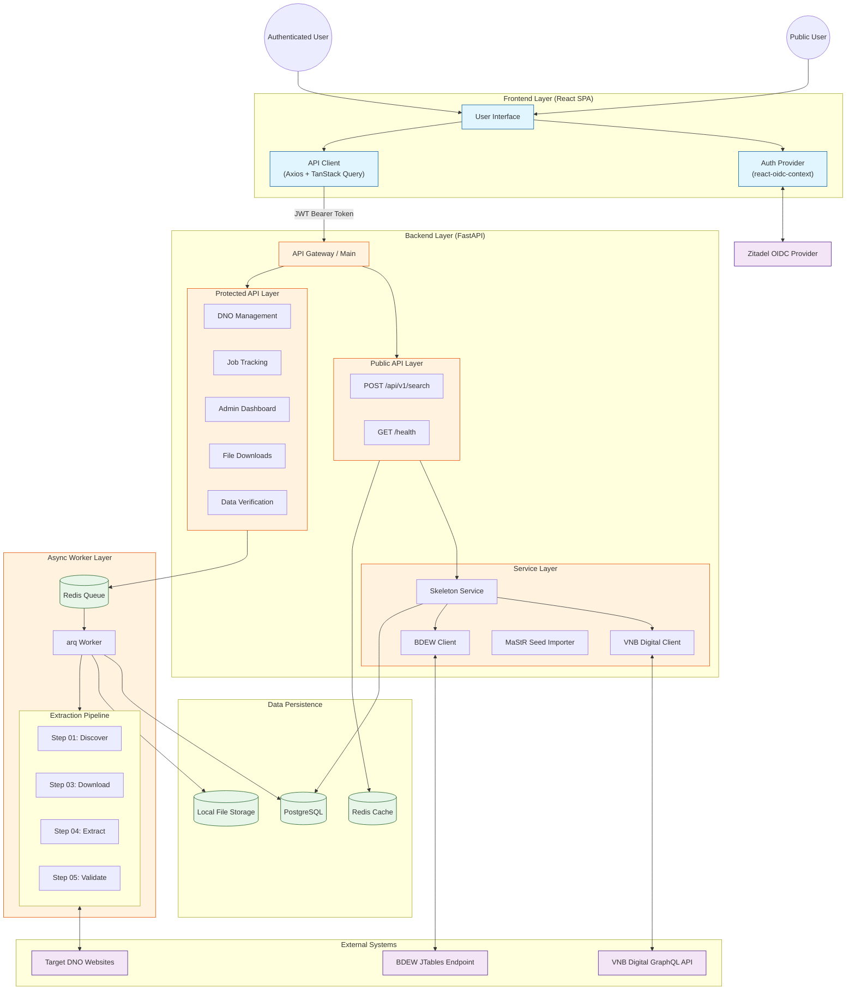
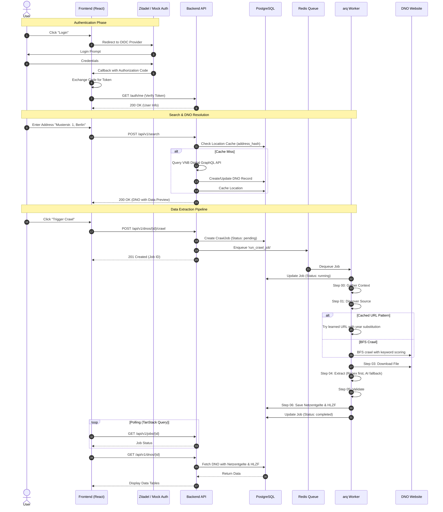
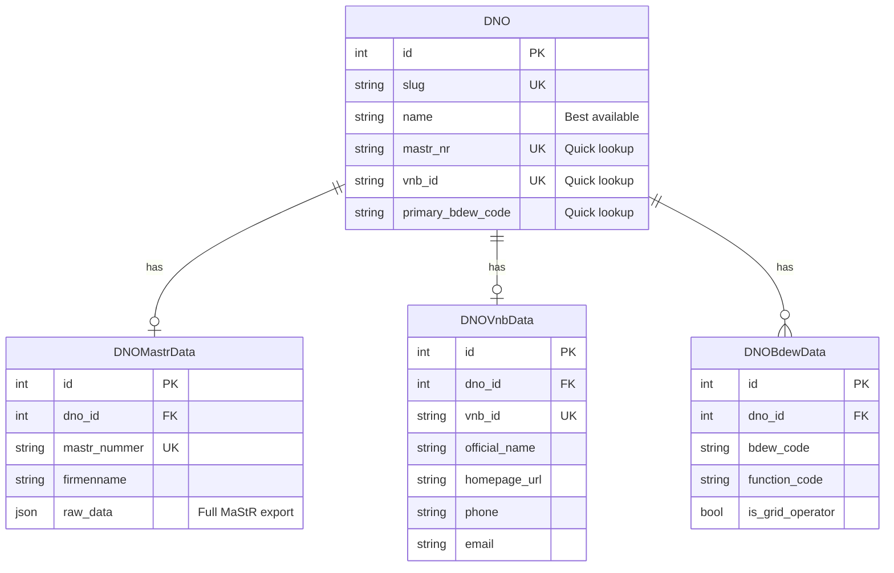
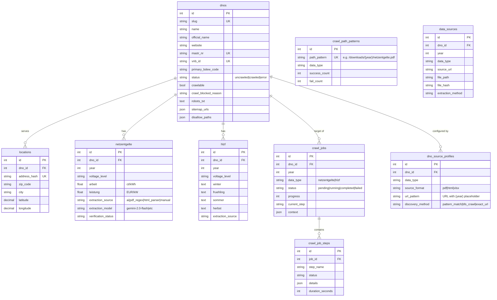
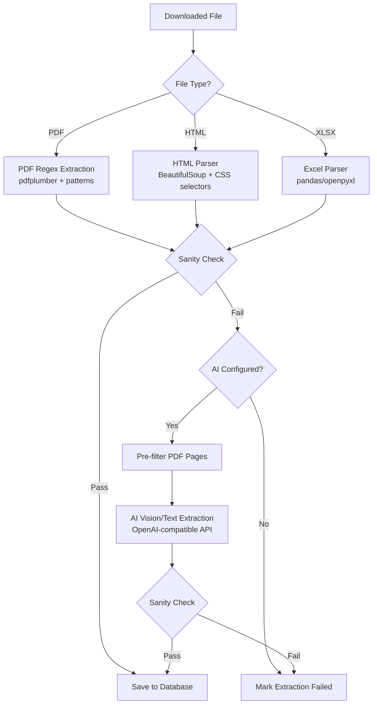

# System Architecture

## Overview

DNO Crawler is a full-stack application for automated extraction of regulatory data from German Distribution Network Operators (DNOs). The system features a React SPA frontend for user interaction and a FastAPI backend that orchestrates data retrieval via synchronous APIs and asynchronous background workers.

## 1. System Architecture

The system follows a microservices-lite architecture with clear separation between the API layer, background processing, and data persistence.



### Key Components

- **Frontend**: React SPA with OIDC authentication via react-oidc-context. Attaches JWT tokens to requests via Axios interceptors. TanStack Query manages server state with automatic caching and polling.
- **Public API**: Rate-limited endpoints for address search and skeleton DNO creation. No authentication required.
- **Protected API**: Secured by `Depends(get_current_user)`. Provides DNO management, job triggering, data verification, and admin functions.
- **Service Layer**: Integrates with three external data sources:
  - **VNB Digital**: GraphQL API for real-time address-to-DNO resolution
  - **BDEW Registry**: JTables endpoint (POST request interception) for BDEW codes
  - **MaStR Importer**: Processes manual CSV/XML exports from Bundesnetzagentur
- **Async Worker**: arq-powered Redis worker executes multi-step extraction pipeline without blocking HTTP requests.

---

## 2. Core User Journey



---

## 3. External Data Sources

The system aggregates DNO metadata from three authoritative sources using a hub-and-spoke pattern.



| Source | Method | Update Frequency | Data Provided |
|--------|--------|------------------|---------------|
| **VNB Digital** | GraphQL API queries | Real-time | Address resolution, official names, homepage URLs, contact info |
| **Marktstammdatenregister** | Manual XML/CSV export | Periodic (manual) | Market roles (Marktrollen), ACER codes, legal names, registered addresses |
| **BDEW Codes Registry** | JTables POST interception | On-demand | BDEW identification codes, grid operator function codes |

---

## 4. Database Schema



### Key Entities

- **DNOModel (`dnos`)**: Hub entity in a hub-and-spoke pattern. Contains resolved display fields (best values from MaStR/VNB/BDEW), quick-access external IDs, and crawlability metadata.
- **Source Data Tables**: `dno_mastr_data`, `dno_vnb_data`, `dno_bdew_data` store raw data from each external source.
- **LocationModel (`locations`)**: Maps addresses and coordinates to DNOs. Uses `address_hash` for O(1) cache lookups.
- **Data Tables (`netzentgelte`, `hlzf`)**: Extracted pricing and time-window data with provenance tracking (extraction source, model used).
- **Source Profiles (`dno_source_profiles`)**: Per-DNO learned patterns for fast re-crawling.
- **Path Patterns (`crawl_path_patterns`)**: Cross-DNO URL patterns with success/failure statistics for prioritized discovery.
- **Job Tracking (`crawl_jobs`, `crawl_job_steps`)**: State machine for background tasks with step-level granularity.

---

## 5. Extraction Pipeline

The extraction layer implements a cost-aware, deterministic-first approach.



### Sanity Validation Rules

| Data Type | Rule |
|-----------|------|
| Netzentgelte | ≥3 voltage levels, each with at least one price value (arbeit or leistung) |
| HLZF | ≥1 record with winter time window present |

### AI Optimization

1. Extract text from each PDF page using pdfplumber
2. Filter pages containing target keywords (reduces payload by 60-80%)
3. Send optimized PDF to vision model
4. If no data found, retry with full PDF before falling back to failure

---

## 6. Security Architecture

- **Authentication**: OIDC-based via Zitadel. Frontend handles redirect flow and attaches Bearer tokens via Axios interceptors. Mock mode available for development.
- **Authorization**: Role-based access control via `Depends(get_current_user)` and `Depends(require_admin)`.
- **Secret Management**: All credentials managed via environment variables and `.env` files.
- **Rate Limiting**: IP-based rate limiting on public endpoints. Per-user quotas on protected endpoints.
- **Data Protection**: PostgreSQL connections use SSL in production. File storage uses content hashing for integrity verification.

---

## 7. Observability

- **Logging**: Structured JSON logging via `structlog` with correlation IDs for request tracing.
- **Health Endpoint**: `GET /api/v1/health` returns service status for uptime monitoring.
- **Job Visibility**: Real-time step-by-step progress via `crawl_jobs` and `crawl_job_steps` tables, exposed through polling API.
- **Query Logging**: `query_logs` table tracks user searches for analytics.

---

## 8. Production Maintenance

### Database Migrations

Schema changes are versioned via Alembic:

```bash
cd backend
alembic revision --autogenerate -m "description"
alembic upgrade head
```

### Crawl Job Recovery

The `crawl_recovery` service automatically resets jobs stuck in `running` or `crawling` state on backend startup, handling worker crashes or unexpected restarts.

### Container Health Checks

All services in `docker-compose.yml` include health checks:

- **PostgreSQL**: `pg_isready`
- **Redis**: `redis-cli ping`
- **Backend**: `curl /api/health`
