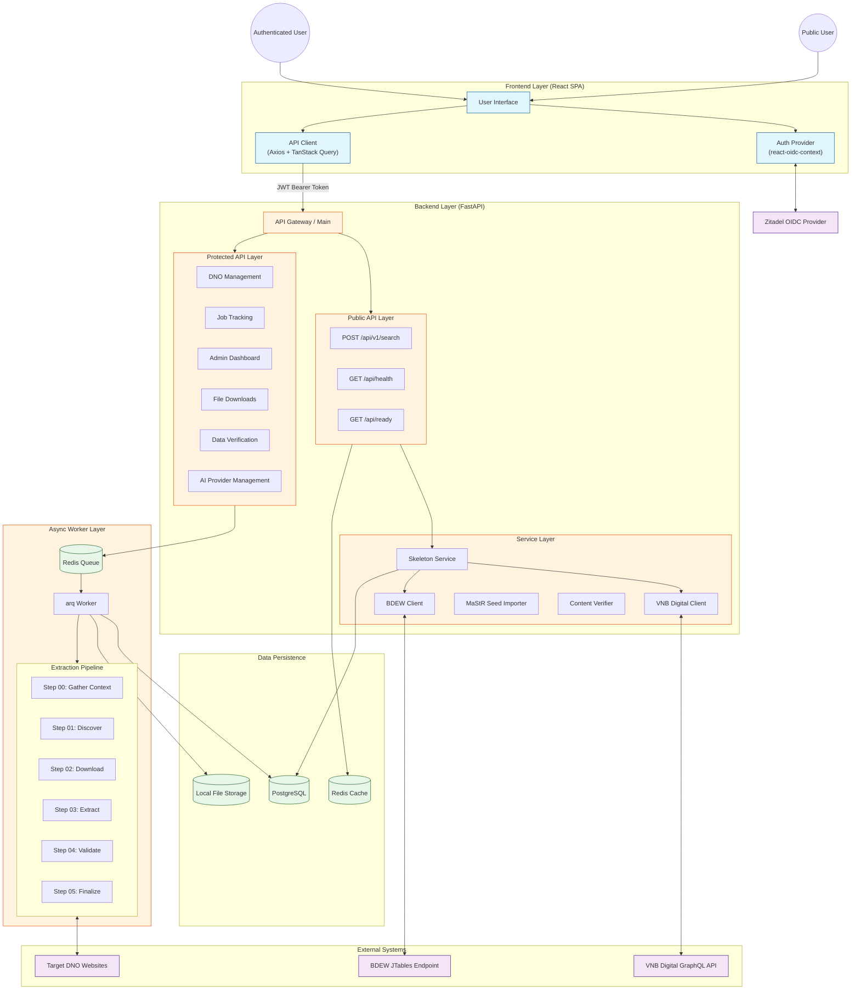
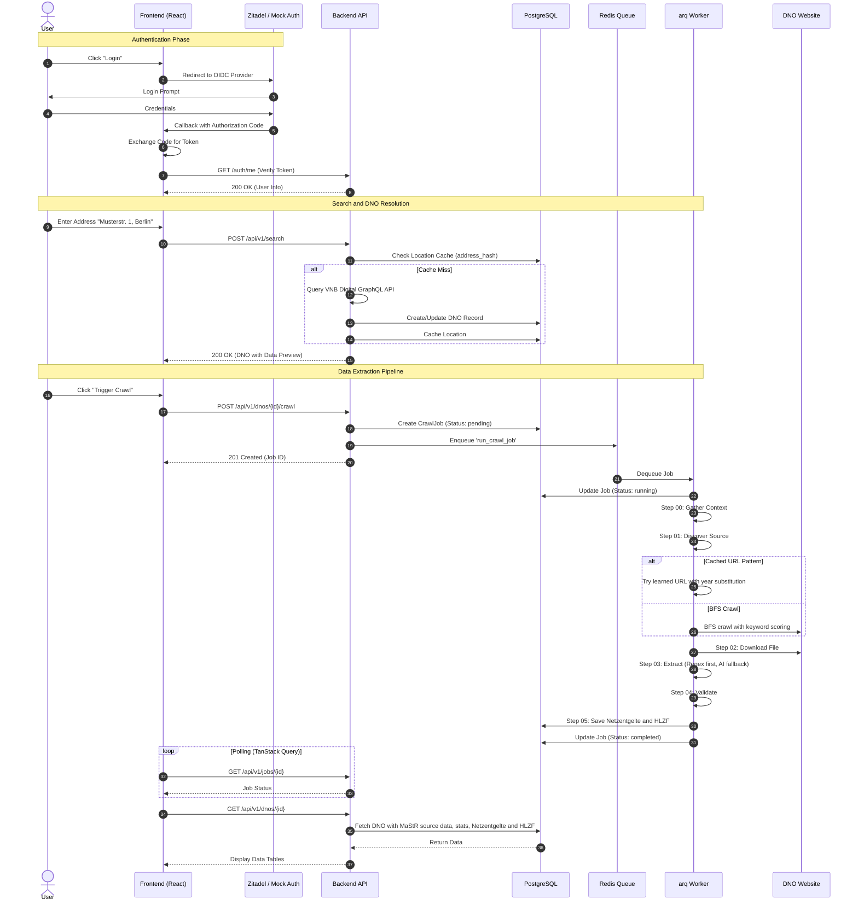
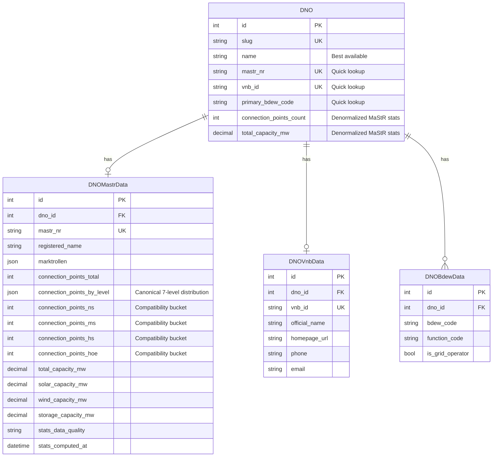
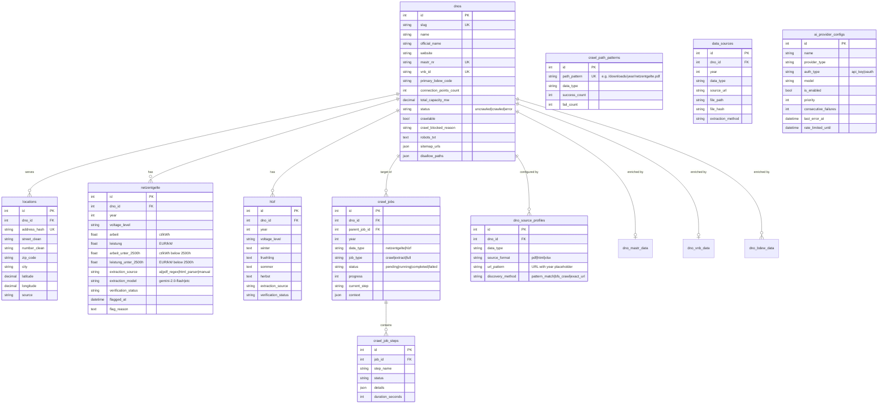

# System Architecture

## Overview

DNO Crawler is a full stack application for automated extraction of regulatory data from German Distribution Network Operators (DNOs). The system features a React SPA frontend for user interaction and a FastAPI backend that orchestrates data retrieval via synchronous APIs and asynchronous background workers.

## 1. System Architecture

The system follows a microservices lite architecture with clear separation between the API layer, background processing, and data persistence.



### Key Components

| Component | Description |
|-----------|-------------|
| Frontend | React 19 SPA with OIDC authentication via react-oidc-context. Attaches JWT tokens to requests via Axios interceptors. TanStack Query manages server state with automatic caching and polling. |
| Public API | Rate limited endpoints for address search and skeleton DNO creation. Health check at `GET /api/health` and readiness check at `GET /api/ready`. No authentication required. |
| Protected API | Secured by `Depends(get_current_user)`. Provides DNO management, job triggering, data verification, AI provider management, and admin functions. |
| Service Layer | Integrates with three external data sources and provides business logic for verification, pattern learning, and content analysis. |
| Async Worker | arq powered Redis workers execute multi step extraction pipeline without blocking HTTP requests. Split into `worker-crawl` (discovery and download, single instance for polite crawling) and `worker-extract` (extraction, validation, finalization, scalable). |

## 2. Core User Journey



## 3. External Data Sources

The system aggregates DNO metadata from three authoritative sources using a hub and spoke pattern.



| Source | Method | Update Frequency | Data Provided |
|--------|--------|------------------|---------------|
| VNB Digital | GraphQL API queries | Real time | Address resolution, official names, homepage URLs, contact info |
| Marktstammdatenregister | Manual XML export, local transformation, backend import | Periodic (manual) | Market roles (Marktrollen), ACER codes, legal names, registered addresses, canonical connection-point distribution, compatibility voltage buckets, network and installed-capacity statistics |
| BDEW Codes Registry | JTables POST interception | On demand | BDEW identification codes, grid operator function codes |

## 4. Database Schema



### Key Entities

| Entity | Description |
|--------|-------------|
| DNOModel (`dnos`) | Hub entity in a hub and spoke pattern. Contains resolved display fields (best values from MaStR/VNB/BDEW), quick access external IDs, denormalized MaStR statistics, and crawlability metadata including robots.txt and sitemap data. |
| Source Data Tables | `dno_mastr_data`, `dno_vnb_data`, `dno_bdew_data` store source data from each external system. `dno_mastr_data` also stores computed MaStR statistics used by API responses. |
| LocationModel (`locations`) | Maps addresses and coordinates to DNOs. Uses `address_hash` for O(1) cache lookups. |
| Data Tables (`netzentgelte`, `hlzf`) | Extracted pricing and time window data with provenance tracking (extraction source, model used) and verification status. |
| Source Profiles (`dno_source_profiles`) | Per DNO learned patterns for fast re crawling. |
| Path Patterns (`crawl_path_patterns`) | Cross DNO URL patterns with success/failure statistics for prioritized discovery. |
| Job Tracking (`crawl_jobs`, `crawl_job_steps`) | State machine for background tasks with step level granularity and parent job linking for split extraction. |
| AI Provider Configs (`ai_provider_configs`) | Multi provider AI configuration supporting API key and OAuth authentication methods, with priority ordering, usage tracking, and automatic failover via consecutive failure counting. |

## 5. Extraction Pipeline

The extraction layer implements a cost aware, deterministic first approach.


### Sanity Validation Rules

| Data Type | Rule |
|-----------|------|
| Netzentgelte | At least 3 voltage levels, each with at least one price value (arbeit or leistung) |
| HLZF | At least 1 record with winter time window present |

### AI Optimization

1. Extract text from each PDF page using pdfplumber
2. Filter pages containing target keywords (reduces payload by 60 to 80 percent)
3. Send optimized PDF to vision model
4. If no data found, retry with full PDF before falling back to failure

## 6. Security Architecture

| Aspect | Implementation |
|--------|----------------|
| Authentication | OIDC based via Zitadel. Frontend handles redirect flow and attaches Bearer tokens via Axios interceptors. Mock mode available for development. |
| Authorization | Role based access control via `Depends(get_current_user)` and `Depends(require_admin)`. |
| Secret Management | All credentials managed via environment variables and `.env` files. |
| Rate Limiting | IP based rate limiting on public endpoints. Per user quotas on protected endpoints. |
| Data Protection | PostgreSQL connections use SSL in production. File storage uses content hashing for integrity verification. |

## 7. Observability

| Aspect | Implementation |
|--------|----------------|
| Logging | Structured JSON logging via `structlog` with correlation IDs for request tracing. |
| Health Endpoint | `GET /api/health` returns service status, `GET /api/ready` checks database and Redis connectivity. |
| Job Visibility | Real time step by step progress via `crawl_jobs` and `crawl_job_steps` tables, exposed through polling API. |
| Query Logging | `query_logs` table tracks user searches for analytics. |
| System Logs | `system_logs` table stores system level events with trace IDs. |

## 8. Production Maintenance

### Database Migrations

Schema changes are versioned via Alembic.

```bash
cd backend
alembic revision --autogenerate -m "description"
alembic upgrade head
```

### Crawl Job Recovery

The `crawl_recovery` service automatically resets jobs stuck in `running` or `crawling` state on backend startup, handling worker crashes or unexpected restarts.

### Container Health Checks

All services in `docker-compose.yml` include health checks.

| Service | Health Check |
|---------|--------------|
| PostgreSQL | `pg_isready` |
| Redis | `redis-cli ping` |
| Backend | `curl /api/health` |
